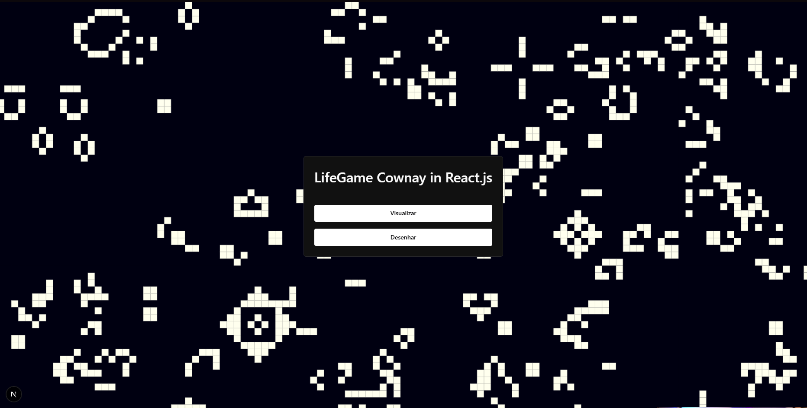

# lifegameConway-react

Uma implementação do famoso **Jogo da Vida** de Conway utilizando React.js.
<div align="center">
   
</div>

## Tecnologias Utilizadas

- **React.js** para construção da interface.
- **Next.js** para renderização e roteamento.
- **Chakra UI** para componentes visuais modernos.
- **TypeScript** para maior segurança no desenvolvimento.

## Funcionalidades

- Visualização da evolução das células em tempo real.
- Possibilidade de desenhar padrões iniciais.

## Como rodar o projeto

1. Instale as dependências:
```
   npm install
```

2. Inicie o servidor de desenvolvimento:
```
   npm run dev
```

3. Acesse no navegador: http://localhost:3000
